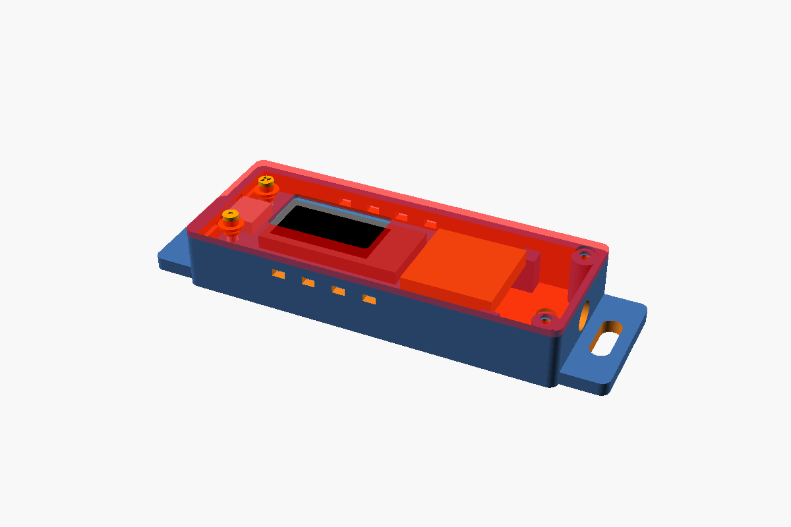

# UAV-BOS Fahrzeug-Tracker

GPS-Tracker für ein Feuerwehrfahrzeug. Er sendet die Fahrzeugposition an
[UAV BOS](https://api.beta.uav-bos.de), damit das Fahrzeug neben den Drohnen auf der Karte erscheint.

- Hardware: Fastsaw / Heltec **Wireless Tracker V1.1** (ESP32-S3, UC6580 GNSS, 0,96" ST7735 TFT)
- Firmware: PlatformIO + Arduino (`src/`)
- Gehäuse: parametrisches OpenSCAD (`case/tracker_case.scad`)

Du hast wenig Erfahrung mit Technik? Dann starte mit der
[Schritt-für-Schritt-Anleitung zum Nachbauen](#nachbau-anleitung-für-einsteiger).


## Nachbau-Anleitung für Einsteiger

Diese Anleitung setzt keine Programmierkenntnisse voraus. Du brauchst weder löten noch
Code schreiben. Plane für den ersten Aufbau etwa 1 bis 2 Stunden ein.

### 1. Einkaufsliste

| Teil | Wofür | Hinweis |
|------|-------|---------|
| **Fastsaw Wireless Tracker** ([Amazon: B0G1MTL1RV](https://www.amazon.de/dp/B0G1MTL1RV)) | Das eigentliche Gerät: GPS-Empfänger, WLAN und kleines Display auf einer Platine | Pflicht. Die Version mit 868 MHz ist die richtige für Deutschland |
| USB-C-Datenkabel | Verbindung zum PC zum Aufspielen der Software, später Stromversorgung | Pflicht. Reine Ladekabel funktionieren nicht, das Kabel muss Daten übertragen können |
| 12/24 V auf USB-Adapter (5 V, mind. 1 A) | Strom im Fahrzeug | Pflicht. Ein normaler Zigarettenanzünder-USB-Adapter reicht |
| Aktive GPS-Magnetantenne mit SMA-Stecker (L1, gerne L1/L5) | Besserer GPS-Empfang im Fahrzeug | Empfohlen. Die kleine Antenne auf der Platine empfängt im Auto oft schlecht |
| Adapterkabel U.FL (auch "IPEX" genannt) auf SMA-Buchse | Verbindet die Antenne mit der Platine | Nur zusammen mit der externen Antenne nötig |
| Gehäuse aus dem 3D-Drucker | Schutz der Platine | Optional, siehe [Gehäuse drucken lassen](#5-gehäuse-optional) |
| 2x Schraube M2 x 6 (selbstschneidend) | Gehäuse verschließen | Nur mit Gehäuse |

Außerdem brauchst du:

- einen Windows-, Mac- oder Linux-PC mit Internet,
- ein Smartphone für die Einrichtung,
- Internet im Fahrzeug: einen LTE-WLAN-Router oder einen Handy-Hotspot. Der Tracker kann nur
  **2,4-GHz-WLAN**, kein 5 GHz.
- die Zugangsdaten von UAV BOS: die **Request-URL** mit Fahrzeug-Schlüssel und API-Schlüssel.
  Diese bekommst du vom Administrator eurer UAV-BOS-Instanz.

### 2. Programme auf dem PC installieren

1. Lade [Visual Studio Code](https://code.visualstudio.com/) herunter und installiere es
   (alle Voreinstellungen übernehmen).
2. Starte Visual Studio Code. Klicke links auf das Symbol mit den vier Quadraten (**Erweiterungen**).
3. Suche nach **PlatformIO IDE** und klicke auf **Installieren**. Das dauert einige Minuten.
   Wenn unten rechts eine Meldung zum Neustart erscheint, bestätige sie.

### 3. Software auf den Tracker aufspielen ("flashen")

1. Kopiere den kompletten Projektordner auf deinen PC (z. B. ZIP herunterladen und entpacken).
2. In Visual Studio Code: **Datei → Ordner öffnen…** und den Projektordner auswählen
   (den Ordner, in dem die Datei `platformio.ini` liegt).
3. Warte, bis PlatformIO fertig ist. Beim ersten Mal lädt es im Hintergrund Werkzeuge
   herunter, das kann 5 bis 10 Minuten dauern.
4. Stecke den Tracker mit dem USB-C-Kabel an den PC.
5. Klicke unten in der blauen Leiste auf den **Pfeil nach rechts** (→, "Upload").
   Am Ende muss im Fenster `SUCCESS` stehen.

**Es klappt nicht?**

- Anderes USB-Kabel probieren. Das ist die häufigste Ursache.
- Den Tracker in den Programmiermodus bringen: Taste **PRG** gedrückt halten, kurz **RST**
  drücken, **PRG** loslassen. Dann erneut auf den Pfeil klicken.
- Nach dem Aufspielen einmal **RST** drücken oder das Kabel kurz ab- und wieder anstecken.

Wenn alles geklappt hat, zeigt das Display das UAV-BOS-Logo und danach den Einrichtungsbildschirm.

### 4. Tracker einrichten (mit dem Smartphone)

1. Der Tracker öffnet ein eigenes WLAN namens **`UAV-BOS-Tracker-XXXX`** (Name steht auf dem Display).
2. Verbinde dein Smartphone mit diesem WLAN. Die Einstellungsseite öffnet sich automatisch.
   Falls nicht: im Browser `http://192.168.4.1` aufrufen.
3. Trage ein:
   - **WLAN-Name (SSID) und Passwort** des Fahrzeug-Routers bzw. Hotspots. Mit "Suchen" werden
     WLANs in der Nähe angezeigt.
   - **Request-URL** von UAV BOS, z. B.
     `https://api.beta.uav-bos.de/telemetry/objects/<Fahrzeug-Schlüssel>/<API-Schlüssel>`
   - **Sendeintervall**: 5 Sekunden sind ein guter Wert.
   - **AP-Passwort** (empfohlen, mind. 8 Zeichen). Schützt das Einrichtungs-WLAN und die
     Einstellungsseite (Benutzername `admin`).
4. Auf **"Speichern & Neustart"** tippen.

Der Tracker startet neu, verbindet sich mit dem Fahrzeug-WLAN und beginnt zu senden, sobald er
GPS-Empfang hat. Beim ersten Mal kann das unter freiem Himmel einige Minuten dauern. Auf dem
Display siehst du die Anzahl der Satelliten und, ob das Senden klappt (grün = ok, rot = Fehler).

### 5. Gehäuse (optional)

Die fertigen Druckdateien liegen im Ordner `case/`: `base.stl`, `lid.stl`, `plunger_user.stl`
(Punkt) und `plunger_reset.stl` (X). Hast du keinen 3D-Drucker, kannst du die Dateien bei einem
Online-Druckdienst hochladen oder jemanden aus dem Bekanntenkreis bzw. einem Makerspace fragen.
Wichtig: Material **PETG oder ASA**. PLA wird im heißen Auto weich.

Zusammenbau:

1. Die beiden Plunger (kleine Stifte) von innen in die Tastenlöcher im Deckel stecken. Von oben
   gesehen, mit der USB-C-Seite zu dir: links Reset (X), rechts USER (Punkt).
2. Platine in das Unterteil legen, die USB-C-Buchse zeigt in die Öffnung.
3. Bei externer Antenne: SMA-Buchse des Adapterkabels in das Loch im Gehäuse schrauben und den
   kleinen U.FL-Stecker vorsichtig auf den GNSS-Anschluss der Platine drücken.
4. Deckel vorne einhaken, hinten absenken, verschrauben: Den Deckel hinten leicht angehoben
   ansetzen, sodass die zwei Haken an der USB-C-Seite in die Taschen der Stirnwand greifen,
   dann hinten absenken und mit den zwei M2-Schrauben verschließen.

### 6. Einbau im Fahrzeug

- **Strom**: USB-Adapter in die 12/24-V-Steckdose, USB-C-Kabel zum Tracker. Hängt die Steckdose
  an der Zündung, wird die Fahrzeugbatterie nicht entladen. Bei Dauerstrom bleibt das Fahrzeug
  auch geparkt sichtbar.
- **Antenne**: Die Magnetantenne aufs Dach oder unter ein Kunststoffteil mit freier Sicht zum
  Himmel. Nicht unter Metall.
- **Tracker**: an einer Stelle befestigen, an der er nicht herumfliegt. Das Gehäuse hat Laschen
  für Schrauben oder Kabelbinder.
- **Test**: Fahrzeug starten, kurz warten und prüfen, ob es in UAV BOS auf der Karte erscheint.

### Bedienung im Alltag

- **Taste PRG kurz drücken**: Display an/aus.
- **Taste PRG 3 Sekunden halten**: Einrichtungs-WLAN öffnen, z. B. um das WLAN zu ändern.
  Erneut 3 Sekunden halten, um zurückzuwechseln.
- Findet der Tracker das Fahrzeug-WLAN nicht, öffnet er nach 30 Sekunden automatisch das
  Einrichtungs-WLAN und wechselt zurück, sobald das Fahrzeug-WLAN wieder da ist.

## Was die Firmware macht

1. Schaltet das GNSS-Modul und das Display ein (Vext) und zeigt einen Startbildschirm.
2. Verbindet sich mit dem konfigurierten WLAN (LTE-Router im Fahrzeug oder Handy-Hotspot).
3. Wenn keine Konfiguration vorhanden ist oder das WLAN nicht innerhalb von 30 s erreichbar ist,
   öffnet er einen eigenen Access Point **`UAV-BOS-Tracker-XXXX`** mit Captive Portal unter `http://192.168.4.1`.
   - Nach 5 Minuten ohne Aktivität versucht er erneut das Fahrzeug-WLAN.
   - Wurde der AP wegen eines Timeouts geöffnet, wechselt er automatisch zurück, sobald das
     Fahrzeug-WLAN erreichbar ist und niemand mit dem AP verbunden ist.
4. Solange er verbunden ist, sendet er alle *n* Sekunden (Standard 5) die Position per POST an die konfigurierte URL:

   ```
   POST <konfigurierte URL, genau wie eingegeben>
   Content-Type: application/json

   {"latitude":53.5503000,"longitude":7.6694000,"altitude":12.0,"speed":13.9,"heading":270,"accuracy":5.0}
   ```

   | Feld       | Quelle                                                                |
   |------------|-----------------------------------------------------------------------|
   | latitude   | GNSS, 7 Nachkommastellen                                              |
   | longitude  | GNSS, 7 Nachkommastellen                                              |
   | altitude   | Meter über dem Meeresspiegel                                          |
   | speed      | **m/s** (13,9 m/s = 50 km/h)                                          |
   | heading    | Kurs über Grund in Grad, wird unter 1 m/s gehalten                    |
   | accuracy   | Meter, aus `$GNGST`, falls das Modul es sendet, sonst HDOP x 2,5      |

   Gesendet wird nur mit gültigem Fix, der weniger als 2 s alt ist. Bei Fehlern verdoppelt sich
   das Intervall (max. 60 s), bis wieder erfolgreich gesendet wurde.

### Display

| Bildschirm   | Inhalt                                                                  |
|--------------|-------------------------------------------------------------------------|
| Start        | UAV-BOS-Logo, Firmware-Version                                          |
| Verbinden    | SSID, verstrichene Zeit                                                 |
| Konfig-AP    | AP-Name, AP-Passwort, `http://192.168.4.1`, verbundene Geräte           |
| Betrieb      | WLAN-RSSI, GPS-Status/Satelliten/HDOP, Position, Geschwindigkeit, Kurs, Höhe, Genauigkeit, letzte Sendung (Alter + HTTP-Code, grün/rot), Sendezähler, IP |

### Taste (PRG)

- **Kurz drücken**: Display-Hintergrundbeleuchtung an/aus
- **3 s halten**: Konfig-AP öffnen (im AP-Modus erneut halten, um zurück ins WLAN zu wechseln)

## Flashen

1. [PlatformIO](https://platformio.org/) installieren (VS-Code-/Cursor-Erweiterung oder `pip install platformio`).
2. Board per USB-C anschließen.
3. Bauen und hochladen:

   ```
   pio run -t upload
   pio device monitor
   ```

   Startet der Upload nicht: **PRG** gedrückt halten, **RST** antippen, **PRG** loslassen und erneut versuchen.

## Ersteinrichtung

1. Tracker mit Strom versorgen. Ohne Konfiguration öffnet er den AP `UAV-BOS-Tracker-XXXX`.
2. Mit dem Smartphone verbinden. Die Einstellungsseite öffnet sich automatisch (sonst `http://192.168.4.1` aufrufen).
3. Eintragen:
   - **SSID / Passwort** des Fahrzeug-WLANs ("Suchen" startet einen Scan)
   - **Request-URL**, z. B. `https://api.beta.uav-bos.de/telemetry/objects/<vehicle-key>/<api-key>`
   - **Sendeintervall** in Sekunden
   - optional **AP-Passwort** (mind. 8 Zeichen). Schützt auch die Webseite, Benutzer `admin`.
4. "Speichern & Neustart". Der Tracker startet neu, verbindet sich und beginnt zu senden.

Im Betrieb ist dieselbe Status-/Einstellungsseite unter der IP erreichbar, die auf dem Display steht.
Im Fahrzeug-WLAN wird die gespeicherte URL nur maskiert angezeigt, da sie den API-Schlüssel enthält.
Setze ein AP-Passwort, wenn sich weitere Geräte das Fahrzeug-WLAN teilen.

"Werkseinstellungen" auf der Seite löscht alle Einstellungen.

## Einbau im Fahrzeug

- **GNSS-Antenne**: Im Auto bekommt die kleine Onboard-/FPC-Antenne oft einen schlechten Fix.
  Verwende ein U.FL-auf-SMA-Pigtail und eine aktive magnetische GPS-Antenne (L1/L5) auf dem Dach
  oder unter einem Kunststoffteil mit Sicht zum Himmel. Das Gehäuse hat dafür ein Loch für eine SMA-Einbaubuchse.
- **Strom**: 12/24 V auf USB-C-Adapter (5 V, 1 A reicht völlig). Zündungsplus verhindert, dass die
  Fahrzeugbatterie entladen wird. Dauerplus hält das Fahrzeug auch geparkt sichtbar.
- **WLAN**: Der Tracker braucht Internet über den LTE-Router im Fahrzeug oder einen Hotspot (nur 2,4 GHz).

## Gehäuse (`case/tracker_case.scad`)

Teile: Unterteil, Deckel (kopfüber gedruckt) und zwei Stößel mit eingravierter Markierung:
`plunger_user.stl` (Punkt) und `plunger_reset.stl` (X). Vorgerenderte STLs und Vorschaubilder liegen in `case/`.

Außenmaße: 84,4 x 32,7 x 14,2 mm (mit GNSS-SMA-Loch), zuzüglich Befestigungslaschen.



Die Standardwerte sind am Fastsaw-Board gemessen. Alle Positionen gelten ab der PCB-Vorderkante (USB-C-Seite).
"Links"/"rechts" heißt: von oben gesehen, USB-C-Anschluss zeigt zu dir.

| Parameter                        | Standard / Bedeutung                                                     |
|----------------------------------|--------------------------------------------------------------------------|
| `pcb_l`, `pcb_w`, `pcb_t`        | 63,6 x 27,9 x 1,7 mm unbestückte Platine                                 |
| `usb_overhang`, `rear_overhang`  | USB-C steht 1,0 mm vorne über, GPS-Modul 1,0 mm hinten                   |
| `stop_adjust`                    | 2,5: verschiebt die hinteren Anschläge Richtung USB-Ende (aus Testdruck) |
| `holddown_x`                     | `pcb_l - 3.7`: Position der Niederhalter-Stifte im Deckel ab PCB-Vorderkante (aus Testdruck) |
| `front_hook`                     | zwei Haken am Deckel (USB-C-Seite) greifen in Taschen der Stirnwand; `hook_w`, `hook_len`, `hook_t`, `hook_nose` für die Maße |
| `top_clear`                      | 4,3: GPS-Modul (3,8, höchstes Bauteil oben) + Luft                       |
| `bottom_clear`                   | 4,0: Stecker auf der Unterseite am USB-Ende (3,6) + Luft. Etwa 9 bei eingelöteten Stiftleisten |
| `disp_x0`, `disp_w`, `disp_h`    | sichtbare Displayfläche: beginnt bei 11,7 mm, 23,2 x 12,3 mm, mittig in der Breite |
| `frame_x0`, `frame_w`, `frame_h` | Displayrahmen: beginnt bei 10 mm, 32,5 x 16,1 mm (Vertiefung für eine klare Abdeckung) |
| `btn_x`, `user_btn_y`, `reset_btn_y` | Tasten 3,22 mm von vorne; USER 6,2 mm von rechts, Reset 6,2 mm von links |
| `reset_mode`                     | `"plunger"` (Standard), `"pinhole"` (2 mm, Büroklammer) oder `"none"`   |
| `usb_w`, `usb_h`, `usb_z`        | 8,8 x 3,2 mm USB-C, Mitte 1,6 mm über der Platinenoberseite              |
| `gnss_sma`, `lora_sma`           | Löcher für SMA-Einbaubuchsen                                             |
| `sma_min_in_h`                   | 11 mm Innenhöhe für eine SMA-Mutter. Mit SMA-Loch wird der Raum unter der Platine entsprechend größer |
| `front_supports`                 | kleine Stützen unter den vorderen Platinenecken. Deaktivieren, wenn sie mit dem Stecker auf der Unterseite kollidieren |
| `mount_ears`                     | geschlitzte Laschen für M4-Schrauben oder Kabelbinder                    |

Nicht gemessen, angenommen: Der USB-C-Anschluss sitzt mittig in der Breite und direkt auf der Platine.
`gnss_sma = false` macht das Gehäuse 1 mm niedriger. Probier das aus, wenn das Onboard-GPS-Modul
durch den Deckel einen guten Fix bekommt.

Export:

```
openscad -o base.stl    -D 'part="base"'    case/tracker_case.scad
openscad -o lid.stl     -D 'part="lid"'     case/tracker_case.scad
openscad -o plunger_user.stl  -D 'part="plunger_user"'  case/tracker_case.scad
openscad -o plunger_reset.stl -D 'part="plunger_reset"' case/tracker_case.scad
```

`part="assembly"` zeigt alles zusammengebaut mit einem Dummy-Board.

Zusammenbau: Die beiden Stößel in die Tastenlöcher des Deckels stecken, Board einlegen (USB-C in die Öffnung),
SMA-Einbaubuchse montieren, Deckel vorne einhaken, hinten absenken und mit 2x M2 x 6 selbstschneidenden
Schrauben verschließen. Ein 0,5 mm klares
PET-/Acrylfenster kann innen in die Vertiefung des Deckels geklebt werden.

Druck in **PETG oder ASA**. PLA wird in einem in der Sonne geparkten Auto weich. 0,2 mm Schichthöhe, 3 Wände, keine Stützen.

## Firmware anpassen

| Was                               | Wo                                                         |
|-----------------------------------|------------------------------------------------------------|
| Pins, Display-Versatz/-Invertierung | `src/pins.h` (`TFT_COL_OFFSET`, `TFT_ROW_OFFSET`, `TFT_INVERT`) |
| Geschwindigkeitseinheit, JSON-Format | `uplink::buildJson` in `src/uplink.cpp`                 |
| Genauigkeitsschätzung (UERE)      | `kUereMeters` in `src/gnss.cpp`                            |
| Timeouts (WLAN, AP-Leerlauf, Taste) | Anfang von `src/main.cpp`                                |
| TLS-Zertifikatsprüfung            | `-DUPLINK_VERIFY_TLS` in `platformio.ini` einkommentieren (ISRG Root X1, genutzt von api.beta.uav-bos.de) |

Ist das Displaybild verschoben, zeigt einen Rauschstreifen oder invertierte Farben, passe die
`TFT_*`-Werte in `src/pins.h` an. Klone verwenden manchmal ein leicht anderes Panel.
