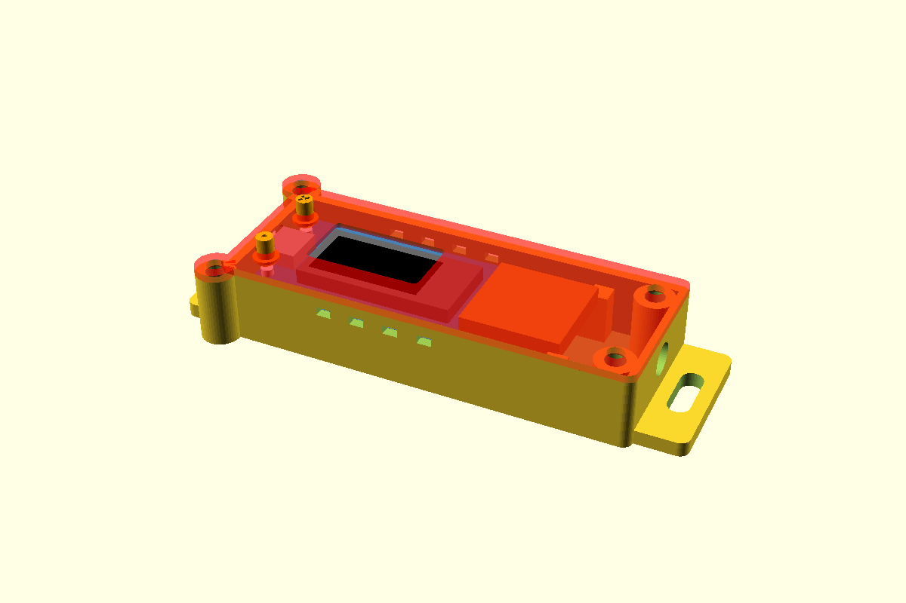
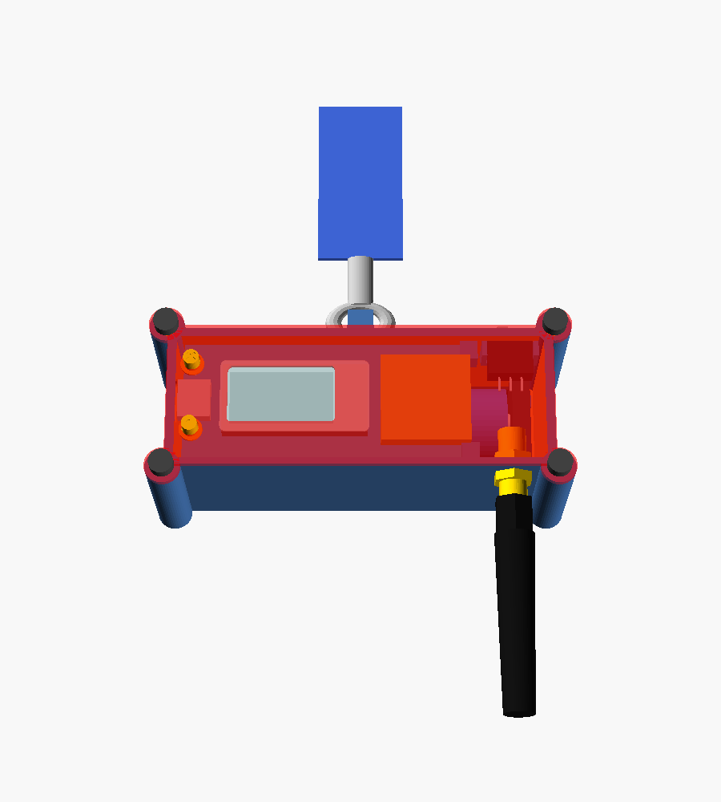
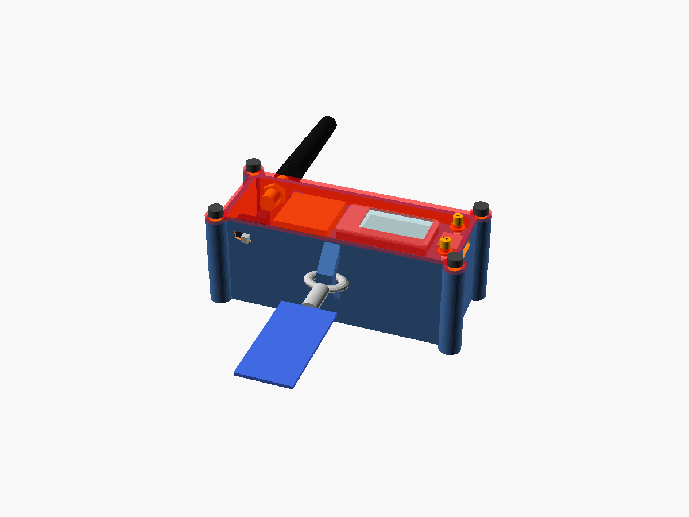
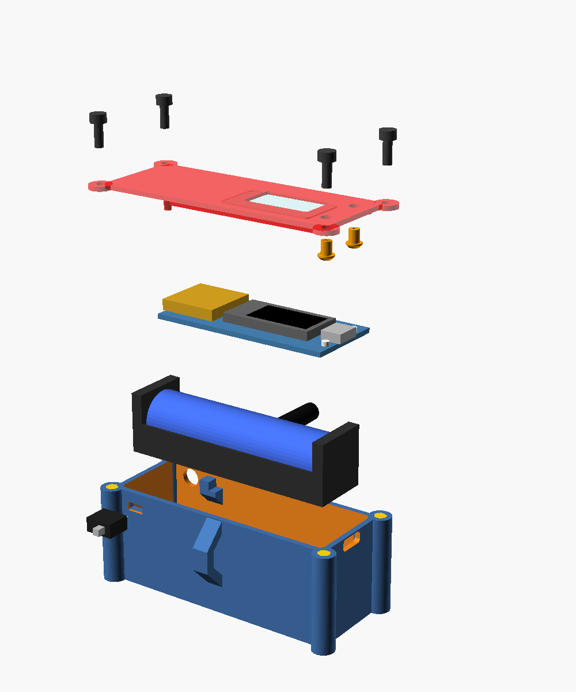

# UAV-BOS Fahrzeug-Tracker

GPS-Tracker für ein Feuerwehrfahrzeug. Er sendet die Fahrzeugposition an
[UAV BOS](https://gps.beta.uav-bos.de), damit das Fahrzeug neben den Drohnen auf der Karte erscheint.

- Hardware: Fastsaw / Heltec **Wireless Tracker V1.1** (ESP32-S3, UC6580 GNSS, 0,96" ST7735 TFT)
- Firmware: PlatformIO + Arduino (`src/`)
- Gehäuse: parametrisches OpenSCAD (`case/tracker_case.scad`), Akku-Version für Personen (`case/tracker_case_battery.scad`)

> **Firmware ganz einfach aufspielen:** Tracker per USB-C anschließen und auf
> [ubhtwf.open-drone-tools.de](https://ubhtwf.open-drone-tools.de/) auf **Installieren** klicken.
> Das funktioniert direkt im Browser (Google Chrome oder Microsoft Edge am PC), ohne Software-Installation.

Du hast wenig Erfahrung mit Technik? Dann starte mit der
[Schritt-für-Schritt-Anleitung zum Nachbauen](#nachbau-anleitung-für-einsteiger).

## Nachbau-Anleitung für Einsteiger

Diese Anleitung setzt keine Programmierkenntnisse voraus. Du brauchst weder löten noch
Code schreiben. Plane für den ersten Aufbau etwa 1 bis 2 Stunden ein.

### 1. Einkaufsliste

| Teil | Wofür | Hinweis |
|------|-------|---------|
| **Fastsaw Wireless Tracker** ([Amazon: B0G1MTL1RV](https://www.amazon.de/dp/B0G1MTL1RV)) | Das eigentliche Gerät: GPS-Empfänger, WLAN und kleines Display auf einer Platine | Pflicht. Die Version mit 868 MHz ist die richtige für Deutschland |
| USB-C-Datenkabel | Verbindung zum PC zum Aufspielen der Software, später Stromversorgung | Pflicht. Reine Ladekabel funktionieren nicht, das Kabel muss Daten übertragen können |
| 12/24 V auf USB-Adapter (5 V, mind. 1 A) | Strom im Fahrzeug | Pflicht. Ein normaler Zigarettenanzünder-USB-Adapter reicht |
| Aktive GPS-Magnetantenne mit SMA-Stecker (L1, gerne L1/L5) | Besserer GPS-Empfang im Fahrzeug | Empfohlen. Die kleine Antenne auf der Platine empfängt im Auto oft schlecht |
| Adapterkabel U.FL (auch "IPEX" genannt) auf SMA-Buchse | Verbindet die Antenne mit der Platine | Nur zusammen mit der externen Antenne nötig |
| Gehäuse aus dem 3D-Drucker | Schutz der Platine | Optional, siehe [Gehäuse drucken lassen](#5-gehäuse-optional) |
| 4x Zylinderkopfschraube M3 x 8 ([Amazon: B0B3MGZ7T2](https://www.amazon.de/dp/B0B3MGZ7T2)) | Gehäuse verschließen | Nur mit Gehäuse |
| 4x Einschmelzgewinde ruthex M3 x 5,7 ([Amazon: B08BCRZZS3](https://www.amazon.de/dp/B08BCRZZS3)) | Gewinde für die Deckelschrauben, werden mit einem Lötkolben in das Unterteil eingeschmolzen | Nur mit Gehäuse |
| **868-MHz-LoRa-Antenne mit Magnetfuß** ([Amazon: B09Y8NF2P7](https://www.amazon.de/dp/B09Y8NF2P7)) | Empfohlen für das Führungsfahrzeug im Gateway-Betrieb | Yilianduo, 2 dBi, Glasfaserstab, Magnetfuß mit 3-m-Kabel (RP-SMA-Stecker) |
| **18650-Batteriehalter** ([Amazon: B0GWJ7VMMB](https://www.amazon.de/dp/B0GWJ7VMMB)) | Für den tragbaren Tracker | Hugcows, Einzelhalter mit Litzen, für geschützte Zellen. Siehe [Akku-Version](#akku-version-für-personen-casetracker_case_batteryscad) |
| **Schiebeschalter** ([Amazon: B09TVDZ8P2](https://www.amazon.de/dp/B09TVDZ8P2)) | Für den tragbaren Tracker | RUNCCI-YUN, 3-polig, 2 Stellungen. Gehäuse mit `sw_type = "RUNCCI"`. Siehe [Akku-Version](#akku-version-für-personen-casetracker_case_batteryscad) |

Außerdem brauchst du:

- einen Windows-, Mac- oder Linux-PC mit Internet,
- ein Smartphone für die Einrichtung,
- Internet im Fahrzeug: einen LTE-WLAN-Router oder einen Handy-Hotspot. Der Tracker kann nur
  **2,4-GHz-WLAN**, kein 5 GHz.
- die Zugangsdaten von UAV BOS: die **Request-URL** mit Fahrzeug-Schlüssel und API-Schlüssel.
  Diese bekommst du vom Administrator eurer UAV-BOS-Instanz.

### 2. Programme auf dem PC installieren

1. Lade [Visual Studio Code](https://code.visualstudio.com/) herunter und installiere es
   (alle Voreinstellungen übernehmen).
2. Starte Visual Studio Code. Klicke links auf das Symbol mit den vier Quadraten (**Erweiterungen**).
3. Suche nach **PlatformIO IDE** und klicke auf **Installieren**. Das dauert einige Minuten.
   Wenn unten rechts eine Meldung zum Neustart erscheint, bestätige sie.

### 3. Software auf den Tracker aufspielen ("flashen")

**Am einfachsten:** Tracker per USB-C anschließen, in Google Chrome oder Microsoft Edge
[ubhtwf.open-drone-tools.de](https://ubhtwf.open-drone-tools.de/) öffnen und auf **Installieren** klicken.
Dann brauchst du die folgenden Schritte und Visual Studio Code nicht.

Alternativ mit PlatformIO:

1. Kopiere den kompletten Projektordner auf deinen PC (z. B. ZIP herunterladen und entpacken).
2. In Visual Studio Code: **Datei → Ordner öffnen…** und den Projektordner auswählen
   (den Ordner, in dem die Datei `platformio.ini` liegt).
3. Warte, bis PlatformIO fertig ist. Beim ersten Mal lädt es im Hintergrund Werkzeuge
   herunter, das kann 5 bis 10 Minuten dauern.
4. Stecke den Tracker mit dem USB-C-Kabel an den PC.
5. Klicke unten in der blauen Leiste auf den **Pfeil nach rechts** (→, "Upload").
   Am Ende muss im Fenster `SUCCESS` stehen.

**Es klappt nicht?**

- Anderes USB-Kabel probieren. Das ist die häufigste Ursache.
- Den Tracker in den Programmiermodus bringen: Taste **PRG** gedrückt halten, kurz **RST**
  drücken, **PRG** loslassen. Dann erneut auf den Pfeil klicken.
- Nach dem Aufspielen einmal **RST** drücken oder das Kabel kurz ab- und wieder anstecken.

Wenn alles geklappt hat, zeigt das Display das UAV-BOS-Logo und danach den Einrichtungsbildschirm.

### 4. Tracker einrichten (mit dem Smartphone)

1. Der Tracker öffnet ein eigenes WLAN namens **`UAV-BOS-Tracker-XXXX`** (Name steht auf dem Display).
2. Verbinde dein Smartphone mit diesem WLAN. Die Einstellungsseite öffnet sich automatisch.
   Falls nicht: im Browser `http://192.168.4.1` aufrufen.
3. Trage ein:
   - **WLAN-Name (SSID) und Passwort** des Fahrzeug-Routers bzw. Hotspots. Mit "Suchen" werden
     WLANs in der Nähe angezeigt.
   - **Request-URL** von UAV BOS, z. B.
     `https://gps.beta.uav-bos.de/telemetry/objects/<Fahrzeug-Schlüssel>/<API-Schlüssel>`
   - **Sendeintervall**: 5 Sekunden sind ein guter Wert.
   - **Betriebsart**: "Nur WLAN" wie bisher, "Gateway", "Offline" oder "Nur LoRa" für das Funk-Mesh (siehe
     [LoRa-Mesh / Betriebsarten](#lora-mesh--betriebsarten)). Bei "Nur LoRa" darf die SSID leer bleiben.
   - **AP-Passwort** (empfohlen, mind. 8 Zeichen). Schützt das Einrichtungs-WLAN und die
     Einstellungsseite (Benutzername `admin`).
4. Auf **"Speichern & Neustart"** tippen.

Der Tracker startet neu, verbindet sich mit dem Fahrzeug-WLAN und beginnt zu senden, sobald er
GPS-Empfang hat. Beim ersten Mal kann das unter freiem Himmel einige Minuten dauern. Auf dem
Display siehst du die Anzahl der Satelliten und, ob das Senden klappt (grün = ok, rot = Fehler).

### 5. Gehäuse (optional)

Die fertigen Druckdateien liegen im Ordner `case/`: `base.stl`, `lid.stl`, `plunger_user.stl`
(Punkt) und `plunger_reset.stl` (X). Hast du keinen 3D-Drucker, kannst du die Dateien bei einem
Online-Druckdienst hochladen oder jemanden aus dem Bekanntenkreis bzw. einem Makerspace fragen.
Wichtig: Material **PETG oder ASA**. PLA wird im heißen Auto weich.

Zusammenbau:

1. Einmalig die vier Gewindeeinsätze einschmelzen: Einsatz auf eines der vier Löcher oben im
   Unterteil setzen, mit dem Lötkolben (etwa 230 °C bei PETG) erhitzen und gerade hineindrücken,
   bis er bündig mit der Oberkante ist. Abkühlen lassen.
2. Die beiden Plunger (kleine Stifte) von innen in die Tastenlöcher im Deckel stecken. Von oben
   gesehen, mit der USB-C-Seite zu dir: links Reset (X), rechts USER (Punkt).
3. Platine in das Unterteil legen, die USB-C-Buchse zeigt in die Öffnung.
4. Bei externer Antenne: SMA-Buchse des Adapterkabels in das Loch im Gehäuse schrauben und den
   kleinen U.FL-Stecker vorsichtig auf den GNSS-Anschluss der Platine drücken.
5. Deckel aufsetzen und mit den vier M3-x-8-Schrauben verschließen. Nicht zu fest anziehen.

### 6. Einbau im Fahrzeug

- **Strom**: USB-Adapter in die 12/24-V-Steckdose, USB-C-Kabel zum Tracker. Hängt die Steckdose
  an der Zündung, wird die Fahrzeugbatterie nicht entladen. Bei Dauerstrom bleibt das Fahrzeug
  auch geparkt sichtbar.
- **Antenne**: Die Magnetantenne aufs Dach oder unter ein Kunststoffteil mit freier Sicht zum
  Himmel. Nicht unter Metall.
- **Tracker**: an einer Stelle befestigen, an der er nicht herumfliegt. Das Gehäuse hat Laschen
  für Schrauben oder Kabelbinder.
- **Test**: Fahrzeug starten, kurz warten und prüfen, ob es in UAV BOS auf der Karte erscheint.

### Bedienung im Alltag

- **Taste PRG kurz drücken**: Betriebsart wechseln (Nur WLAN → Gateway → Offline → Nur LoRa, siehe
  [LoRa-Mesh / Betriebsarten](#lora-mesh--betriebsarten)). Jeder weitere Druck springt eine Stufe
  weiter, 3 Sekunden nach dem letzten Druck wird die Auswahl übernommen.
- **Taste PRG 3 Sekunden halten**: Display an/aus.
- **Taste PRG 10 Sekunden halten**: Einrichtungs-WLAN öffnen, z. B. um das WLAN zu ändern.
  Erneut 10 Sekunden halten, um zurückzuwechseln.
- Findet der Tracker das Fahrzeug-WLAN nicht, öffnet er nach 30 Sekunden automatisch das
  Einrichtungs-WLAN und wechselt zurück, sobald das Fahrzeug-WLAN wieder da ist.

## Was die Firmware macht

1. Schaltet das GNSS-Modul und das Display ein (Vext) und zeigt einen Startbildschirm.
2. Verbindet sich mit dem konfigurierten WLAN (LTE-Router im Fahrzeug oder Handy-Hotspot).
3. Wenn keine Konfiguration vorhanden ist oder das WLAN nicht innerhalb von 30 s erreichbar ist,
   öffnet er einen eigenen Access Point **`UAV-BOS-Tracker-XXXX`** mit Captive Portal unter `http://192.168.4.1`.
   - Nach 5 Minuten ohne Aktivität versucht er erneut das Fahrzeug-WLAN.
   - Wurde der AP wegen eines Timeouts geöffnet, wechselt er automatisch zurück, sobald das
     Fahrzeug-WLAN erreichbar ist und niemand mit dem AP verbunden ist.
4. Solange er verbunden ist, sendet er alle *n* Sekunden (Standard 5) die Position per POST an die konfigurierte URL:

   ```
   POST <konfigurierte URL, genau wie eingegeben>
   Content-Type: application/json

   {"latitude":53.5503000,"longitude":7.6694000,"altitude":12.0,"speed":13.9,"heading":270,"accuracy":5.0}
   ```

   | Feld       | Quelle                                                                |
   |------------|-----------------------------------------------------------------------|
   | latitude   | GNSS, 7 Nachkommastellen                                              |
   | longitude  | GNSS, 7 Nachkommastellen                                              |
   | altitude   | Meter über dem Meeresspiegel                                          |
   | speed      | **m/s** (13,9 m/s = 50 km/h)                                          |
   | heading    | Kurs über Grund in Grad, wird unter 1 m/s gehalten                    |
   | accuracy   | Meter, aus `$GNGST`, falls das Modul es sendet, sonst HDOP x 2,5      |

   Gesendet wird nur mit gültigem Fix, der weniger als 2 s alt ist. Bei Fehlern verdoppelt sich
   das Intervall (max. 60 s), bis wieder erfolgreich gesendet wurde.

### Display

| Bildschirm   | Inhalt                                                                  |
|--------------|-------------------------------------------------------------------------|
| Start        | UAV-BOS-Logo, Firmware-Version                                          |
| Verbinden    | SSID, verstrichene Zeit                                                 |
| Konfig-AP    | AP-Name, AP-Passwort, `http://192.168.4.1`, verbundene Geräte           |
| Betrieb      | WLAN-RSSI, GPS-Status/Satelliten/HDOP, Position, Geschwindigkeit, Kurs, Höhe, Genauigkeit, letzte Sendung (Alter + HTTP-Code, grün/rot), Sendezähler, IP |
| Offline      | WLAN-RSSI, GPS wie oben, letzte LoRa-Sendung, gehörte Tracker, Airtime, IP der Webseite |
| Mode-Auswahl | gewählte und aktuelle Betriebsart, Countdown bis zur Übernahme          |
| Nur LoRa     | GPS wie oben, letzte LoRa-Sendung, gehörte Tracker, Weiterleitungen, Airtime, Knoten-ID |

Oben rechts im Kopf steht immer die Betriebsart (`WLAN`, `GW`, `Off`, `LoRa`). Im Gateway-Betrieb zeigt der
Betriebsbildschirm zusätzlich die weitergeleiteten Mesh-Positionen (OK/Fehler) und die Zahl der gehörten Tracker.

### Taste (PRG)

- **Kurz drücken**: Betriebsart wechseln (Übernahme 3 s nach dem letzten Druck)
- **3 s halten**: Display-Hintergrundbeleuchtung an/aus
- **10 s halten**: Konfig-AP öffnen (im AP-Modus erneut halten, um zurück zur Betriebsart zu wechseln)

## LoRa-Mesh / Betriebsarten

Das Board hat einen LoRa-Funkchip (SX1262, 868 MHz). Damit bilden die Tracker ein Funknetz, das mit
[Meshtastic](https://meshtastic.org/) kompatibel ist. Fahrzeuge ohne Internet schicken ihre Position über
das Mesh zu einem Tracker, der Internet hat, und der leitet sie an UAV BOS weiter. Zum reinen
Weiterleiten, ohne eigene Position, gibt es den
[UAV-BOS Mesh-Repeater](https://github.com/denni95112/uav-bos-mesh-repeater)
(Heltec WiFi LoRa 32 V2, kein GPS). Er spricht dasselbe Protokoll und braucht denselben Mesh-Schlüssel.

| Betriebsart  | WLAN | LoRa | Was passiert                                                                  |
|--------------|------|------|-------------------------------------------------------------------------------|
| Nur WLAN     | an   | aus  | Wie bisher: Position per WLAN an UAV BOS                                      |
| Gateway      | an   | an   | Eigene Position per WLAN. Empfängt Positionen anderer Tracker über LoRa und sendet sie an UAV BOS. Leitet Mesh-Pakete weiter. Ohne WLAN wird die eigene Position über LoRa geschickt |
| Offline      | an   | an   | WLAN nur für die Weboberfläche. Keine Positionsmeldung an UAV BOS und keine Update-Prüfung. Eigene Position über LoRa, Pakete anderer Tracker werden weitergeleitet |
| Nur LoRa     | aus  | an   | Eigene Position über LoRa, Pakete anderer Tracker werden weitergeleitet. Braucht nur die Request-URL, kein WLAN |

Jedes Board im Gateway-Betrieb, das Internet hat, kann als Gateway dienen. Es braucht also keinen
zentralen Empfänger. Die Betriebsart bleibt nach einem Neustart erhalten und lässt sich auch auf der
Einstellungsseite wählen.

So funktioniert es:

1. Ein Tracker im Betrieb "Nur LoRa" oder "Offline" sendet beim Start und danach alle 10 Minuten seine Request-URL
   verschlüsselt ins Mesh. Gateways speichern sie (auch über einen Neustart hinweg).
2. Die Position sendet er alle *n* Sekunden (Einstellung "LoRa-Sendeintervall", Standard 30 s, min. 15 s).
   Nach mehr als 100 m Strecke oder 30° Kursänderung schon früher, im Stand höchstens alle 2 Minuten.
3. Ein Gateway sendet die Position unverändert als JSON an die URL des Trackers. Kennt es die URL noch
   nicht, fragt es den Tracker danach.
4. Positionen, die älter als 60 s sind (laut GPS-Zeit), werden verworfen. Hören mehrere Gateways
   dasselbe Paket, bekommt UAV BOS dieselbe Position mehrfach. Das ist unkritisch.

Auf der Seite von UAV BOS ist keine Änderung nötig.

### Mesh-Schlüssel (wichtig)

Die Request-URL enthält den API-Schlüssel und wird über Funk übertragen. Sie ist mit einem Schlüssel
verschlüsselt (AES-256), der auf jedem Tracker gespeichert ist. **Jede Organisation braucht einen eigenen
Schlüssel, alle ihre Tracker denselben.** Ohne Schlüssel nutzt die Firmware einen Platzhalter; das
Display zeigt dann "Standard-Schluessel!".

1. Am ersten Tracker die Einstellungsseite über den Config-AP öffnen und beim Feld **Mesh-Schlüssel**
   auf "Neu" tippen. Alternativ selbst erzeugen: `openssl rand -base64 32`
   (oder in PowerShell: `$b = New-Object byte[] 32; [Security.Cryptography.RandomNumberGenerator]::Create().GetBytes($b); [Convert]::ToBase64String($b)`)
2. Den Schlüssel sicher notieren und bei allen anderen Trackern in dasselbe Feld eintragen.
   Leer lassen = unverändert. Angezeigt wird der gespeicherte Schlüssel nur am Config-AP, nie im
   Fahrzeug-WLAN.
3. Tracker mit anderem Schlüssel oder Kanalnamen (`-DMESH_CHANNEL_NAME`) verstehen sich nicht, leiten die
   Pakete aber trotzdem weiter.

Der Schlüssel bleibt bei Firmware-Updates erhalten und wird erst durch "Werkseinstellungen" gelöscht.

**Schlüssel in der Firmware (optional):** Ist beim Bauen `MESH_PSK_B64` gesetzt (Datei `.env`, siehe
`.env.example`, oder Umgebungsvariable), übernimmt ein Tracker ohne gespeicherten Schlüssel diesen
einmalig. Das ist praktisch, um viele Geräte selbst zu flashen. Aber: **Ein eingebauter Schlüssel lässt
sich aus der Firmware-Datei auslesen.** Solche Builds nie veröffentlichen, also auch nicht über GitHub
Releases oder das Web-Flash-Tool. Den Schlüssel nicht ins Repository schreiben.

Umstieg von älteren Versionen, bei denen der Schlüssel nur in der Firmware steckte: Ein Tracker mit
dieser Firmware speichert den eingebauten Schlüssel beim ersten Start. Danach das GitHub-Secret
`MESH_PSK_B64` löschen, damit weitere Releases keinen Schlüssel mehr enthalten. Da der alte Schlüssel
in veröffentlichten Releases steckt, sollte er anschließend auf allen Trackern durch einen neuen ersetzt
werden.

### Kompatibilität mit Meshtastic

- Standard-Funkparameter wie Meshtastic **EU_868 / LongFast**: 869,525 MHz, 250 kHz, SF11, CR 4/5,
  Sync-Word 0x2B, Präambel 16.
- Pakete verwenden den Meshtastic-Header und die Kanal-Verschlüsselung (AES-CTR) auf einem privaten Kanal
  (`UAV-BOS`), die Nutzdaten laufen über den Port `PRIVATE_APP` (256).
- Normale Meshtastic-Geräte mit demselben Modemprofil leiten die Pakete weiter (Rebroadcast-Modus `ALL`,
  Standard), können sie ohne Schlüssel aber nicht lesen. Umgekehrt leiten die Tracker auch fremde
  Meshtastic-Pakete weiter. Vorhandene Meshtastic-Knoten der Feuerwehr vergrößern so die Reichweite.
  Für Meshtastic-Betreiber: gut platzierte Knoten mit Rolle `ROUTER` (oder `ROUTER_LATE`) und
  Rebroadcast-Modus `ALL` helfen am meisten. `LOCAL_ONLY`, `KNOWN_ONLY` und `NONE` leiten die Tracker-Pakete nicht weiter.
- Im Band 869,4 bis 869,65 MHz sind 10 % Sendezeit erlaubt. Die Firmware zählt die eigene Sendezeit
  (inkl. Weiterleitungen) über die letzte Stunde und sendet oberhalb von 10 % nicht mehr.
- Wie Meshtastic sendet ein Tracker nicht, während er gerade ein Paket empfängt, und prüft vor dem
  Senden per CAD, ob der Kanal frei ist. Weitergeleitete Pakete tragen kein `next_hop`, wie bei einem
  Meshtastic-Knoten ohne bekannte Route.

#### LoRa-Einstellungen (Einstellungsseite, Abschnitt "LoRa / Meshtastic")

Alle Werte gelten nach "Speichern & Neustart". Alle Tracker und die Meshtastic-Knoten, die weiterleiten
sollen, brauchen dasselbe Modemprofil und denselben Frequenz-Slot. Prüft vorher, welches Profil das
Meshtastic-Netz vor Ort verwendet. Ein anderes Profil hört die Tracker gar nicht.

| Einstellung | Standard | Bedeutung |
|-------------|----------|-----------|
| Modemprofil | LongFast | Meshtastic-Profile, die ins Band 869,4–869,65 MHz passen: ShortFast, ShortSlow, MediumFast, MediumSlow, LongFast, LongModerate, LongSlow |
| Frequenz-Slot | Meshtastic-Standard | Nur bei 125-kHz-Profilen (LongModerate, LongSlow): Slot 1 = 869,4625 MHz, Slot 2 = 869,5875 MHz. "Standard" rechnet den Slot wie Meshtastic aus dem Profilnamen. Hat das Meshtastic-Netz einen eigenen Kanalnamen, den Slot von Hand setzen |
| Hop-Limit | 3 | Wie oft eigene Pakete höchstens weitergeleitet werden (1–7). Mehr Hops reichen weiter, belasten aber das ganze Netz |
| Sendeleistung | 22 dBm | 2–22 dBm |
| Weiterleitung | Alle Pakete | "Alle" wie Meshtastic `ALL`; "Nur UAV-BOS-Tracker" leitet nur Pakete vom eigenen Kanal weiter; "Keine" leitet nichts weiter |
| Sendezeit für fremde Pakete | 6 % | Liegt die gesamte Sendezeit (letzte Stunde) über diesem Wert, werden fremde Meshtastic-Pakete nicht mehr weitergeleitet. Der Rest bis 10 % bleibt für eigene Positionen und Tracker-Pakete |
| Mesh-Schlüssel | – | Siehe [Mesh-Schlüssel](#mesh-schlüssel-wichtig) |

Pakete vom eigenen Tracker-Kanal haben beim Weiterleiten Vorrang. Sind alle Weiterleitungsplätze belegt,
verdrängen sie ein wartendes fremdes Paket.

Sendezeit einer Positionsmeldung (44 Byte) je Profil, ungefähr:

| Profil | Sendezeit | Profil | Sendezeit |
|--------|-----------|--------|-----------|
| ShortFast | 0,05 s | LongFast | 0,56 s |
| ShortSlow | 0,09 s | LongModerate | 1,8 s |
| MediumFast | 0,16 s | LongSlow | 3,3 s |
| MediumSlow | 0,3 s | | |

Bei LongSlow reichen 10 % Sendezeit nicht für eine Position alle 30 s. Dann das LoRa-Sendeintervall erhöhen.

#### Sende-Timing

Im Mesh leitet jeder Tracker die Pakete der anderen weiter. Die Sendezeit pro Gerät wächst deshalb mit
der Zahl der Tracker. Faustregel für LongFast: LoRa-Sendeintervall in Sekunden mindestens 5,6 × Anzahl
der Tracker, mit Reserve etwa 10 × Anzahl (10 Tracker: 60–100 s).

Die Firmware entlastet das Netz selbst:

- **Versatz**: Jede Position kommt mit zufälligen ±10 % auf das Intervall. Tracker, die gleichzeitig
  gestartet wurden, senden so nicht dauerhaft im Gleichtakt.
- **Drosselung**: Liegt die Sendezeit der letzten Stunde für Tracker-Pakete (eigene und weitergeleitete)
  über 5 %, verdoppelt der Tracker sein LoRa-Intervall, über 8 % vervierfacht er es. Weitergeleitete
  fremde Meshtastic-Pakete zählen dabei nicht mit, sie haben ihr eigenes Budget. Die Webseite zeigt dann
  "Intervall x2" bzw. "x4", das Display das verlängerte Intervall.
- **Gateways mit Internet** leiten empfangene Positionen nicht weiter, sondern schicken sie direkt an
  UAV BOS. Das gilt nur, solange die letzte Übertragung an UAV BOS in den vergangenen 2 Minuten
  geklappt hat, und nur für Tracker, deren Request-URL das Gateway kennt und an deren URL die letzte
  Übertragung erfolgreich war. Sonst leitet das Gateway die Position weiter, damit ein anderes Gateway
  sie zustellen kann. Request-URLs leiten Gateways immer weiter, weil andere Gateways sie auch brauchen.
- **Gateway ohne Internet**: Ist das WLAN verbunden, schlägt aber die Übertragung fehl (z. B. LTE-Router
  ohne Netz), schickt das Gateway seine eigene Position wie ein Tracker im Betrieb "Nur LoRa" übers Mesh.

#### Diagnose

Der Abschnitt "LoRa-Mesh" auf der Einstellungsseite zeigt die aktive Funkkonfiguration und:

- **Weitergeleitete Pakete**, getrennt nach Tracker-Paketen und fremden Meshtastic-Paketen, sowie fremde
  Pakete, die wegen des Sendezeit-Budgets nicht weitergeleitet wurden.
- **Empfangen über Meshtastic**: Tracker-Pakete, deren letzter Weiterleiter kein bekannter Tracker war.
  Steigt der Wert, vergrößert ein Meshtastic-Knoten tatsächlich die Reichweite. In der Trackerliste steht
  dann "(Meshtastic)" beim Weg. Die Erkennung nutzt nur das letzte Byte der Knoten-ID und ist deshalb
  eine Schätzung.
- **URL wiederholt**: Hört ein Tracker nach dem Senden seiner Request-URL 30 s lang keine Weiterleitung, sendet
  er sie einmal erneut.

Damit Nachbarn auch Gateways als Tracker erkennen, schickt jeder Tracker, der 15 Minuten lang nichts
gesendet hat, eine kurze Kennung (2 Byte, wird nicht weitergeleitet).

### Antenne

Für LoRa muss eine 868-MHz-Antenne am LoRa-Anschluss stecken. **Nie ohne Antenne senden**, das kann den
Funkchip beschädigen. Das Gehäuse hat mit `lora_sma` ein Loch für eine SMA-Einbaubuchse.

## Flashen

1. [PlatformIO](https://platformio.org/) installieren (VS-Code-/Cursor-Erweiterung oder `pip install platformio`).
2. Board per USB-C anschließen.
3. Bauen und hochladen:

   ```
   pio run -t upload
   pio device monitor
   ```

   Startet der Upload nicht: **PRG** gedrückt halten, **RST** antippen, **PRG** loslassen und erneut versuchen.

## Ersteinrichtung

1. Tracker mit Strom versorgen. Ohne Konfiguration öffnet er den AP `UAV-BOS-Tracker-XXXX`.
2. Mit dem Smartphone verbinden. Die Einstellungsseite öffnet sich automatisch (sonst `http://192.168.4.1` aufrufen).
3. Eintragen:
   - **SSID / Passwort** des Fahrzeug-WLANs ("Suchen" startet einen Scan), bei "Nur LoRa" optional
   - **Betriebsart** und **LoRa-Sendeintervall**
   - **Request-URL**, z. B. `https://gps.beta.uav-bos.de/telemetry/objects/<vehicle-key>/<api-key>`
   - **Sendeintervall** in Sekunden
   - optional **AP-Passwort** (mind. 8 Zeichen). Schützt auch die Webseite, Benutzer `admin`.
4. "Speichern & Neustart". Der Tracker startet neu, verbindet sich und beginnt zu senden.

Im Betrieb ist dieselbe Status-/Einstellungsseite unter der IP erreichbar, die auf dem Display steht.

Oben auf der Seite ("Steuerung") lassen sich ohne Neustart die Betriebsart umschalten und das Display
ein- und ausschalten. Der Wechsel zwischen "Nur WLAN", "Gateway" und "Offline" hält die WLAN-Verbindung. Bei "Nur LoRa"
geht das WLAN aus, die Seite ist dann nur noch über den Config-AP erreichbar (Taste 10 s halten).
Ist LoRa aktiv, zeigt der Abschnitt "LoRa-Mesh":

- **Verbundene Tracker**: in den letzten 5 Minuten gehört, getrennt nach direkt und über Weiterleitung.
  LoRa kennt keine feste Verbindung, "verbunden" heißt deshalb "kürzlich gehört".
- **Tracker mit Positionsdaten**: haben in der letzten Stunde mindestens eine Position gesendet.
- eine Liste aller Tracker der letzten Stunde mit Knoten-ID, zuletzt gehört, letzte Position (und Anzahl
  seit dem Start), Hops und Signalstärke. Es zählen nur Tracker mit demselben Mesh-Schlüssel, fremde
  Meshtastic-Geräte werden nur weitergeleitet.
Im Fahrzeug-WLAN wird die gespeicherte URL nur maskiert angezeigt, da sie den API-Schlüssel enthält.
Setze ein AP-Passwort, wenn sich weitere Geräte das Fahrzeug-WLAN teilen.

"Werkseinstellungen" auf der Seite löscht alle Einstellungen.

## Einbau im Fahrzeug

- **GNSS-Antenne**: Im Auto bekommt die kleine Onboard-/FPC-Antenne oft einen schlechten Fix.
  Verwende ein U.FL-auf-SMA-Pigtail und eine aktive magnetische GPS-Antenne (L1/L5) auf dem Dach
  oder unter einem Kunststoffteil mit Sicht zum Himmel. Das Gehäuse hat dafür ein Loch für eine SMA-Einbaubuchse.
- **Strom**: 12/24 V auf USB-C-Adapter (5 V, 1 A reicht völlig). Zündungsplus verhindert, dass die
  Fahrzeugbatterie entladen wird. Dauerplus hält das Fahrzeug auch geparkt sichtbar.
- **WLAN**: Der Tracker braucht Internet über den LTE-Router im Fahrzeug oder einen Hotspot (nur 2,4 GHz).

## Gehäuse (`case/tracker_case.scad`)

Teile: Unterteil, Deckel (kopfüber gedruckt) und zwei Stößel mit eingravierter Markierung:
`plunger_user.stl` (Punkt) und `plunger_reset.stl` (X). Vorgerenderte STLs und Vorschaubilder liegen in `case/`.

Außenmaße: 84,4 x 32,7 x 16,2 mm (mit GNSS-SMA-Loch), zuzüglich Befestigungslaschen. Die zwei
Schraubsäulen an den vorderen Ecken stehen je etwa 4,3 mm nach vorne und zur Seite über
(vorne 41,3 mm breit).



Die Standardwerte sind am Fastsaw-Board gemessen. Alle Positionen gelten ab der PCB-Vorderkante (USB-C-Seite).
"Links"/"rechts" heißt: von oben gesehen, USB-C-Anschluss zeigt zu dir.

| Parameter                        | Standard / Bedeutung                                                     |
|----------------------------------|--------------------------------------------------------------------------|
| `pcb_l`, `pcb_w`, `pcb_t`        | 63,6 x 27,9 x 1,7 mm unbestückte Platine                                 |
| `usb_overhang`, `rear_overhang`  | USB-C steht 1,0 mm vorne über, GPS-Modul 1,0 mm hinten                   |
| `stop_adjust`                    | 2,0: verschiebt die hinteren Anschläge Richtung USB-Ende. War 2,5 aus dem ersten Testdruck; die Platine ging erst nach etwa 0,5 mm Abfeilen der Anschläge ganz rein |
| `holddown_x`                     | `pcb_l - 3.7`: Position der Niederhalter-Stifte im Deckel ab PCB-Vorderkante (aus Testdruck) |
| `insert_hole`, `insert_depth`, `boss_d` | 4,0 mm Loch, 9 mm tief, Dom 8 mm für ruthex M3 x 5,7 Einschmelzgewinde; `screw_clear` 3,4 mm Durchgang im Deckel |
| `front_boss_off`                 | 2,3: vordere Schraubsäulen sitzen diagonal so weit außerhalb der Innenecken (neben der Platine ist kein Platz) |
| `top_clear`                      | 4,3: GPS-Modul (3,8, höchstes Bauteil oben) + Luft                       |
| `bottom_clear`                   | 4,0: Stecker auf der Unterseite am USB-Ende (3,6) + Luft. Etwa 9 bei eingelöteten Stiftleisten |
| `disp_x0`, `disp_w`, `disp_h`    | sichtbare Displayfläche: beginnt bei 10,7 mm (gemessen 11,7, nach Testdruck korrigiert), 23,2 x 12,3 mm, mittig in der Breite |
| `frame_x0`, `frame_w`, `frame_h` | Displayrahmen: beginnt bei 9 mm (mit verschoben), 32,5 x 16,1 mm (Vertiefung für eine klare Abdeckung) |
| `btn_x`, `user_btn_y`, `reset_btn_y` | Tasten 2,22 mm von vorne (gemessen 3,22, nach Testdruck korrigiert); USER 6,2 mm von rechts, Reset 6,2 mm von links |
| `reset_mode`                     | `"plunger"` (Standard), `"pinhole"` (2 mm, Büroklammer) oder `"none"`   |
| `plunger_bottom_trim`, `plunger_top` | 1,0 mm kürzer unten, 2,8 mm Überstand über dem Deckel (aus Testdruck) |
| `usb_w`, `usb_h`, `usb_z`        | 8,8 x 3,2 mm USB-C, Mitte 1,6 mm über der Platinenoberseite              |
| `gnss_sma`, `lora_sma`           | Löcher für SMA-Einbaubuchsen                                             |
| `sma_min_in_h`                   | 13 mm Innenhöhe für eine SMA-Mutter. Mit SMA-Loch wird der Raum unter der Platine entsprechend größer |
| `sma_z`, `sma_nut_d`             | SMA-Lochmitte 9,1 mm über dem Gehäuseboden, damit die Mutter (9,2 mm über Eck) nicht an die Befestigungslaschen stößt |
| `front_supports`                 | kleine Stützen unter den vorderen Platinenecken. Deaktivieren, wenn sie mit dem Stecker auf der Unterseite kollidieren |
| `mount_ears`                     | geschlitzte Laschen für M4-Schrauben oder Kabelbinder                    |

Nicht gemessen, angenommen: Der USB-C-Anschluss sitzt mittig in der Breite und direkt auf der Platine.
`gnss_sma = false` macht das Gehäuse 3 mm niedriger. Probier das aus, wenn das Onboard-GPS-Modul
durch den Deckel einen guten Fix bekommt.

Export:

```
openscad -o base.stl    -D 'part="base"'    case/tracker_case.scad
openscad -o lid.stl     -D 'part="lid"'     case/tracker_case.scad
openscad -o plunger_user.stl  -D 'part="plunger_user"'  case/tracker_case.scad
openscad -o plunger_reset.stl -D 'part="plunger_reset"' case/tracker_case.scad
```

`part="assembly"` zeigt alles zusammengebaut mit einem Dummy-Board.

Zusammenbau: 4x ruthex M3 x 5,7 von oben in die Dome des Unterteils einschmelzen, die beiden Stößel in die
Tastenlöcher des Deckels stecken, Board einlegen (USB-C in die Öffnung), SMA-Einbaubuchse montieren und den
Deckel mit 4x M3 x 8 Zylinderkopfschrauben verschließen. Ein 0,5 mm klares
PET-/Acrylfenster kann innen in die Vertiefung des Deckels geklebt werden.

Druck in **PETG oder ASA**. PLA wird in einem in der Sonne geparkten Auto weich. 0,2 mm Schichthöhe, 3 Wände, keine Stützen.

## Akku-Version für Personen (`case/tracker_case_battery.scad`)

Tragbarer Tracker, z. B. für Suchtrupps im Betrieb "Nur LoRa". Er wird an einem normalen Schlüsselband
mit Karabiner um den Hals getragen. Eine 18650-Zelle in einem Standard-Halter liegt unter der Platine.
Displayfenster, Tasten und Deckel sind wie beim Fahrzeuggehäuse.





### Was das Board schon kann

Geprüft am [Schaltplan V1.1 (HTIT-Tracker_V0.5)](https://resource.heltec.cn/download/Wireless_Tracker/Wireless_Tacker1.1/HTIT-Tracker_V0.5.pdf)
und am [Datenblatt](https://resource.heltec.cn/download/Wireless_Tracker/Wireless%20Tracker1.1.pdf):

| Funktion | Auf dem Board | Bauteil |
|----------|---------------|---------|
| Akkuanschluss | ja | JP3, SH1.25 2-polig, Unterseite am USB-Ende. Pin 1 = VBAT, Pin 2 = GND |
| Laden über USB-C | ja, 500 mA, Ladeschluss 4,2 V | TP4054 (linear), R16 = 2 kΩ |
| Umschaltung USB / Akku | ja | P-MOSFET Q1 (AO3401) + Schottky D1 (1N5819). Bei USB läuft das Board vom USB, der Akku wird nur geladen |
| 3,3-V-Versorgung | ja, kein Aufwärtswandler nötig | 2x LDO CE6260B33M (Board und Vext für GNSS/TFT) |
| Akkuspannung messen | ja | Teiler 390k/100k an GPIO1, über GPIO2 zuschaltbar (`PIN_BAT_ADC` in `src/pins.h`) |
| Tiefentladeschutz, Kurzschlussschutz | **nein** | |
| Ein/Aus-Schalter | **nein** | |
| Verpolschutz am Akkuanschluss | **nein** | |

Ein Spannungswandler ist also nicht nötig: Die LDOs arbeiten direkt mit der Zellspannung (bis etwa 3,5 V
volle 3,3 V, darunter sinkt die Versorgung langsam mit). Es fehlen aber ein Schalter und ein
Tiefentladeschutz. Das Board würde die Zelle sonst bis zum Brownout des ESP32 (etwa 2,7 V) leeren.

Laufzeit (Schätzung, nicht gemessen): im Betrieb "Nur LoRa" mit GNSS und Display etwa 100 bis 130 mA,
mit 3000 bis 3500 mAh also grob 20 bis 30 Stunden. Display aus verlängert die Laufzeit, WLAN/Gateway
verkürzt sie deutlich. Volles Laden mit 500 mA dauert 7 bis 8 Stunden.

### Zusätzliche Teile

| Teil | Hinweis |
|------|---------|
| **Geschützte** 18650-Li-Ion-Zelle mit Button-Top, 3000 bis 3500 mAh | Mit eingebauter Schutzschaltung (Tiefentlade-, Überlade-, Kurzschlussschutz), dadurch keine Schutzplatine nötig. Typisch 68 bis 70 mm lang, 18,5 bis 18,8 mm dick. Nur aus seriösem Fachhandel, Länge im Datenblatt prüfen |
| Batteriehalter **MPD BH-18650-W** ([Datenblatt](https://www.memoryprotectiondevices.com/datasheets/BH-18650-W/BH-18650-W-datasheet.pdf)) | 77,7 x 20,9 x 21,3 mm, 150-mm-Litzen (24 AWG) an beiden Enden, ausgelegt für geschützte Zellen. Erhältlich z. B. bei Conrad, Mouser, DigiKey. Laut Hersteller mit Klebeband befestigen |
| Schiebeschalter **C&K TS01CQE** ([Datenblatt](https://catalogue2.pss-electrocomponents.com/catalogue/437/TS01CQE.pdf)) | 1x Um, Silberkontakte, 3 A bei 28 V DC. Gehäuse 10,2 x 5,1 x 8,8 mm, Hebel 3,1 mm, 3 mm Schaltweg. Erhältlich z. B. bei TME, Mouser, Farnell |
| SH1.25-Akkukabel, 2-polig | Liegt dem Heltec-Board bei, beim Fastsaw prüfen |
| U.FL-auf-SMA-Pigtail (ca. 10 cm) + 868-MHz-Antenne mit SMA-Stecker | LoRa-Antenne an der Unterkante, zeigt beim Tragen nach unten. Eine kurze Stummelantenne ist am Körper robuster als eine lange |
| 4x ruthex M3 x 5,7 + 4x M3 x 8 | wie beim Fahrzeuggehäuse |
| doppelseitiges Schaumklebeband, Schrumpfschlauch, Litze 0,14 bis 0,25 mm² | Halter auf den Boden kleben, Lötstellen isolieren |
| Schlüsselband (ca. 20 mm) mit Karabinerhaken | Der Haken greift in den Bügel oben in der Mitte. Der Steg ist 3,5 mm dick, die Hakenöffnung muss das schaffen. **Empfohlen: Schlüsselband mit Sicherheitsverschluss im Nacken**, der bei Zug aufgeht. Im Unterholz kann man sonst am Band hängen bleiben |

Die Stößel sind dieselben wie beim Fahrzeuggehäuse (`plunger_user.stl`, `plunger_reset.stl`).

Nicht geeignet sind die üblichen Mini-Schiebeschalter SS-12D00 (C&K: 0,3 A bei 6 V) und E-Switch EG1218 (0,2 A).
Der Ladestrom des Boards beträgt 500 mA und fließt über den Schalter.

Ausweichlösung aus dem Amazon-Sortiment:

- **Schalter RUNCCI-YUN (B09TVDZ8P2)**: mit `sw_type = "RUNCCI"` vorbereitet. Laut Angebot 0,5 A bei 50 V DC
  (bzw. 2 A bei 125 V AC), Gehäuse 12,7 x 6,6 mm, Hebel 5 mm. Bei 0,5 A gibt es keine Reserve zum Ladestrom, es
  gibt kein Datenblatt. Bei 4,2 V ist das in der Praxis meist unkritisch, der TS01CQE bleibt aber die bessere Wahl.
  Das Gehäuse ist 2,5 mm länger als der TS01, deshalb entfallen die seitlichen Stege, nur die Wandtasche hält ihn.
  Gehäusetiefe, Hebelquerschnitt und Schaltweg stehen nicht im Angebot. Vor dem Druck nachmessen und die Werte in
  `sw_presets` eintragen. Der Hebel steht etwa 4 mm heraus und kann sich am Band oder in der Kleidung verhaken.
- **Halter Hugcows (B0GWJ7VMMB)**: laut Angebot für geschützte Zellen, aber ohne Maßangaben. Halter nachmessen und
  `hold_l`, `hold_w`, `hold_h` setzen (Höhe = Boden bis Oberkante der Endwände). Das Gehäuse wächst in Länge und
  Höhe mit. In der Breite passen Halter bis etwa 25 mm. Billige Federkontakte können bei Erschütterung kurz
  unterbrechen, das Board startet dann neu. Die Zelle mit einem Streifen Klebeband im Halter sichern.

Andere Bauteile gehen auch, dann die Parameter `hold_*`, `cell_*` und `sw_*` anpassen. Mit einer ungeschützten Zelle
braucht es zusätzlich eine 1S-Schutzplatine (DW01A + FS8205A) und einen Halter, der für 65-mm-Zellen ausgelegt ist.

### Verdrahtung

```
Halter + (hinten, Schalterseite) ── TS01 Pin 2 (Mitte)     TS01 Pin 1 ── SH1.25 Pin 1 (VBAT, +)
Halter − (vorne, USB-Seite) ─────────────────────────────────────────── SH1.25 Pin 2 (GND, −)
```

Halter so einkleben, dass das Plus-Ende hinten beim Schalter liegt. Dann ist der Minuspol vorne direkt am
Akkustecker der Platine, und die Plus-Litze läuft nur bis zum Schalter. Vom Schalter führt eine kurze Litze unter der
Platine nach vorne zum Stecker. Pin 3 des Schalters bleibt frei.

- **Polarität vor dem Einstecken mit dem Multimeter prüfen.** Das Board hat keinen Verpolschutz, und
  Akkukabel von Drittanbietern haben oft vertauschte Farben. Maßgeblich ist die Markierung an JP3 auf der Platine.
- Laden geht nur bei Schalter **EIN**, weil der Laderegler hinter dem Schalter sitzt. Bei Schalter AUS und
  USB läuft das Board vom USB, lädt aber nicht.
- Zum Lagern Schalter auf AUS. Die Schutzschaltung der Zelle schaltet erst bei etwa 2,5 V ab, das ist nur die letzte Sicherung.

### Gehäuse

Außenmaße: 86,7 x 32,7 x 36,0 mm, zuzüglich Schraubsäulen (je 4,3 mm diagonal) und Bügel (8 mm), ohne Antenne.

Beim Tragen hängt das Gerät quer, weil das Display im Querformat läuft:

- **Oben**: Bügel für den Karabiner in der Mitte, daneben hinten der Ein/Aus-Schalter.
- **Unten**: LoRa-Antenne, zeigt senkrecht nach unten (gleiche Polarisation wie die anderen Knoten).
- **Seite**: USB-C zum Laden, auch während das Gerät hängt.
- Der Bügel sitzt nahe am Deckel, oberhalb des Schwerpunkts. Das Display kippt dadurch etwas nach oben
  zum Träger und zum Himmel (gut für die Onboard-GNSS-Antenne).

Welche Längsseite oben ist, legt `lanyard_side` fest. Standard ist `"left"` (von oben gesehen, USB-C zu dir:
die Seite mit der Reset-Taste). Am fertigen Fahrzeug-Tracker prüfen, wo die Oberkante der Schrift ist; steht
sie bei `"left"` auf dem Kopf, `lanyard_side = "right"` setzen. Bügel, Schalter und Antenne wechseln dann gemeinsam die Seite.

| Parameter | Standard / Bedeutung |
|-----------|----------------------|
| `hold_l`, `hold_w`, `hold_h` | 77,7 x 20,9 x 21,3 mm MPD BH-18650-W (Boden bis Oberkante der Endwände), `hold_clr` 0,6 mm deckt die Toleranz von ±0,5 mm ab |
| `hold_lead_space` | 2,5 mm an beiden Enden für Lötfahnen und Litzen |
| `bottom_clear` | 5,0: Raum zwischen Halter und Platine für Akkustecker und Litzen |
| `lanyard`, `lanyard_side` | Bügel für das Schlüsselband (Standard an), Seite, die beim Tragen oben ist |
| `lug_w`, `lug_depth`, `lug_bar`, `lug_open` | Bügel 6 mm breit, steht 8 mm ab, Steg 3,5 mm, Durchlass am Steg 6 mm hoch; `lug_x` verschiebt ihn entlang der Kante |
| `power_switch`, `sw_type`, `sw_presets` | Schlitz, Tasche und Halterung für den Schalter in der Oberkante, `sw_type` = `"TS01CQE"` oder `"RUNCCI"`. In der Tasche ist die Wand nur `sw_wall` dick (TS01 1 mm, damit der kurze Hebel etwa 2 mm heraussteht). Seitliche Stege nur, wenn das hintere Fach lang genug ist. Der Schalter wird von innen eingeklebt |
| `lora_sma`, `gnss_sma` | LoRa-SMA in der Unterkante (Standard an), GNSS-SMA an der Stirnseite (Standard aus) |
| `strap_loops`, `strap_w` | Alternative zum Bügel: flache Laschen mit Schlitz für 25-mm-Gurtband (Standard aus) |

Die Platine liegt an den vier Ecken auf Konsolen, die aus den Seitenwänden kommen. Damit kollidieren sie
nicht mit dem Halter, und sie drucken wegen der 45°-Unterseite ohne Stützen. Der Bügel ist von der
Stirnseite gesehen ein Sechseck mit 45°-Schrägen und druckt ebenfalls ohne Stützen. Seine Schichten liegen
in Zugrichtung, er hält deshalb deutlich mehr als das Gewicht des Geräts. Die Werte für Platine,
Display, Tasten, Anschläge und Niederhalter sind aus dem Fahrzeuggehäuse übernommen.

Export:

```
openscad -o case/battery_base.stl -D 'part="base"' case/tracker_case_battery.scad
openscad -o case/battery_lid.stl  -D 'part="lid"'  case/tracker_case_battery.scad
```

`part="assembly"` zeigt das zusammengebaute Gerät mit allen Teilen, `part="exploded"` die Explosionsansicht.

Zusammenbau: Gewindeeinsätze einschmelzen. Schalter von innen in den Schlitz setzen und verkleben.
Halterlitzen, Schalter und Akkukabel verlöten und isolieren. Halter mit Schaumklebeband zwischen die
Rippen am Boden kleben, Zelle einsetzen. SMA-Buchse montieren, U.FL auf den LoRa-Anschluss stecken.
Polarität prüfen, Akkustecker einstecken, Platine einlegen (USB-C in die Öffnung), Stößel in den Deckel,
Deckel verschrauben. Karabiner des Schlüsselbands in den Bügel einhängen.

Das Gehäuse ist nicht wasserdicht (USB-Öffnung, Schalterschlitz). Bei Regen eine Hülle verwenden. Druck in PETG oder ASA.

## Firmware-Release

Ein Push auf den Branch `release` startet `.github/workflows/release-firmware.yml`. Die Action baut die
Firmware und legt ein GitHub Release an. Ist das Secret `MESH_PSK_B64` gesetzt, wird der Schlüssel
eingebaut und ist damit öffentlich lesbar (siehe [Mesh-Schlüssel](#mesh-schlüssel-wichtig)). Die Versionsnummer steht in
`platformio.ini` bei `-DFW_VERSION`. Der Tag ist diese Version mit vorangestelltem `v`, aktuell
`v1.0.1`. Zeigt der Tag schon auf einen anderen Commit, bricht der Lauf ab. Dann zuerst `FW_VERSION`
erhöhen und den Branch `release` erneut pushen.

### Automatisches Update (OTA)

Nach dem Einschalten prüft der Tracker in den Betriebsarten Nur WLAN und Gateway, sobald er verbunden
ist, ob es ein neueres Release gibt. Dazu lädt er `version.txt` aus dem neuesten Release
(`releases/latest/download/version.txt`). Ist die Version höher als die eigene, lädt er
`uav-bos-tracker-<version>.bin`, zeigt den Fortschritt im Display, installiert die Firmware und startet
neu. Schlägt der Download fehl, bleibt die alte Firmware aktiv. Die Prüfung läuft nur in den ersten
10 Minuten nach dem Start (bei Netzfehlern jede Minute erneut), damit der Tracker nie mitten im Einsatz
neu startet. Im Betrieb Offline bleibt das WLAN an, es wird aber nicht auf Updates geprüft. Die Verbindung zu GitHub läuft über TLS mit fest hinterlegten Root-Zertifikaten
(`src/certs.cpp`).

Updates kommen aus dem Repository in `OTA_REPO` (Standard `denni95112/uav-bos-hardware-tracker`). Auch
selbst gebaute Firmware hat eine Versionsnummer aus `platformio.ini` und wird ersetzt, sobald dort ein
neueres Release erscheint. Wer eine eigene Variante betreibt, setzt `-DOTA_REPO=\"owner/repo\"` auf das
eigene Repository. Nur Builds ohne `FW_VERSION` im Format `x.y.z` prüfen nicht auf Updates. Der
Mesh-Schlüssel bleibt bei Updates erhalten.

## Firmware anpassen

| Was                               | Wo                                                         |
|-----------------------------------|------------------------------------------------------------|
| Pins, Display-Versatz/-Invertierung | `src/pins.h` (`TFT_COL_OFFSET`, `TFT_ROW_OFFSET`, `TFT_INVERT`) |
| Geschwindigkeitseinheit, JSON-Format | `uplink::buildJson` in `src/uplink.cpp`                 |
| Genauigkeitsschätzung (UERE)      | `kUereMeters` in `src/gnss.cpp`                            |
| Timeouts (WLAN, AP-Leerlauf, Taste) | Anfang von `src/main.cpp`                                |
| TLS-Zertifikatsprüfung            | Standard an, Root-Zertifikate in `src/certs.cpp` (Let's Encrypt für gps.beta.uav-bos.de, GitHub). Für Server mit anderer CA das Zertifikat ergänzen oder notfalls `-DUPLINK_INSECURE_TLS` setzen |
| Update-Quelle (OTA)               | `-DOTA_REPO` in `platformio.ini`                           |
| Mesh-Schlüssel                    | Einstellungsseite; optional als Startwert `MESH_PSK_B64` in `.env` oder als Umgebungsvariable |
| Mesh-Kanalname                    | `-DMESH_CHANNEL_NAME` in `platformio.ini`                    |
| LoRa-Funkparameter, Airtime-Limit, Hop-Limit | Anfang von `src/mesh.cpp`                       |
| LoRa-Nachrichtenformat            | `src/meshproto.cpp`                                        |
| Weiterleitung, Alterslimit 60 s   | `src/gateway.cpp`                                          |

Ist das Displaybild verschoben, zeigt einen Rauschstreifen oder invertierte Farben, passe die
`TFT_*`-Werte in `src/pins.h` an. Klone verwenden manchmal ein leicht anderes Panel.
